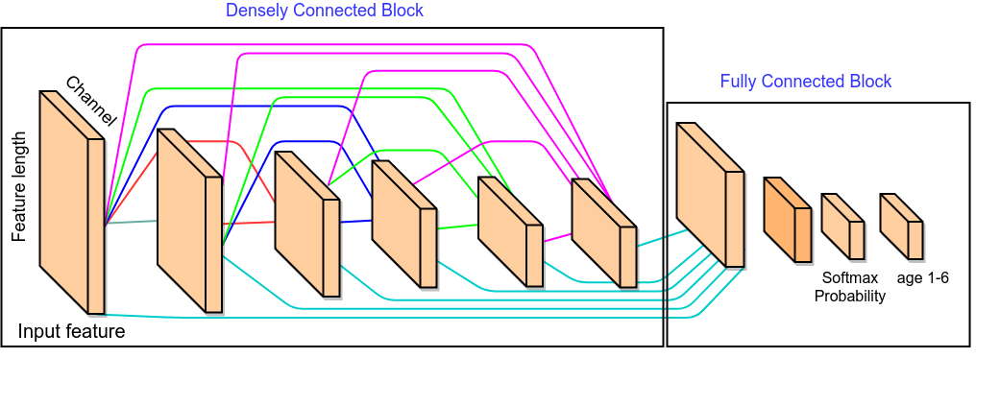

## Digix2019华为算法精英挑战赛代码

最终成绩: 决赛第九

### 问题

根据手机型号，颜色，用户偏好，手机APP等信息预测用户年龄．

### 解决方案

这次比赛我们主要选择神经网络和lightgbm两种模型

#### 神经网络

我们主要搭建了两种神经网络，一种是全连接神经网络，另外一种是密集连接神经网络(**Dense connected block+ Fully connected block**)，我们在神经网络的搭建中，结合回归和分类两方面的损失，对模型进行优化。

**全连接神经网络**

神经网络主要使用全连接, 使用了两种结构， 第一种是将数据整合为一个数据表， 输入一个几层全连接网络，使用了Dropout, 结构、参数和使用的数据如表1-1，详细模型参数和模型搭建，见程序(**main.py**文件)

```python
model = Sequential()
model.add(Dense(1024, activation='relu', input_shape=(two_train.shape[1],)))
model.add(Dropout(0.6))
model.add(Dense(512, activation='relu'))
model.add(Dropout(0.5))
model.add(Dense(256, activation='relu'))
model.add(Dropout(0.5))
model.add(Dense(256, activation='relu'))
model.add(Dropout(0.5))
model.add(Dense(6, activation='softmax'))
model.summary()
adam = optimizers.Adam(lr=0.00009, beta_1=0.9, beta_2=0.999)
model.compile(loss='categorical_crossentropy',optimizer=adam,metrics=['accuracy'])
```

#### **Dense connected block+ Fully connected block**

 为减少参数，加速训练时间，我们使用了另外一种神经网络结构，底层先对各个分开的数据表分开输入，并使用densely connected的网络结构, 使用了正则化, Batch normalization, 初始化权重等。网络结构详见图1-6 ，同时为了提升网络的泛化性能，我们使用了mean_squared_error 和 cross entropy两种loss来训练整个网络，并设置权重，使得模型在验证集当中，达到最优的结果。在学习率方面，我们采用逐epoch衰减和随batch衰减的学习率。

 为了减少网络参数和加快训练速度，我们对不同数据输入用Dense block单独处理，将不同Dense block的输出合并后，输入两层全连接网络得到64维向量，分别接入6维全连接层和1维全连接层，分别得到最小均方回归值和分类Softmax概率.

这种网络相比一般全连接网络和其它模型缩短了训练时间，只需要两个epoch就可以在验证集达到0.645以上的精准率，同时线上可以达到0.648的准确率；除此之外，这种网络在数据量增加后可以通过调整网络结构参数直接得到表达力更强的网络和更好的效果。(**代码详见** **runtrain.py**)




Dense block的实现代码

参数：

Learning rate: 采用了逐epoch衰减和随batch衰减，具体参数见程序(**runtrain.py**文件)；

Regularize: Dense block采用了l1正则化，Fully connected部分采用了l2正则化；

Batch Normalization: 网络的每一层均使用了batch normalization;

Architecture：每个数据表的处理特征部分使用了不同的网络结构和层数;

Loss：为了提高模型的泛化性能，我们使用了mean_squared_error和categorical_crossentropy两种loss来训练整个网络， 但考虑到最终任务是分类， 我们对两者设置了不同的权重，即交叉熵的权重远大于最小均方差；

```python
regularizer_para_2 = regularizers.l2(0.01)
learning_rate = 0.003
dim_bhv = 8
dim_bsc1 = 7
dim_bsc2 = 739  # 'city prodName color ct carrier'
dim_act = 9401
dim_time = 9401
dim_duration = 9401
dim_time_new = 9402
dim_duration_new = 9402
dim_tfidf =  9401
dim_app = 56340
dim_app1 = 40
dropout_rate = 0.01
Initializer = initializers.he_uniform()#initializers.TruncatedNormal()
input_app, encode_app = dense_add(dim_app, [1024, 256,  128, 64], 64)
input_bhv, encode_bhv = dense_add(dim_bhv, [32,  16], 16)
input_bsc1, encode_bsc1 = dense_add(dim_bsc1, [32,  16], 16)
input_app1, encode_app2 = dense_add(dim_app1, [32,  16], 32)
input_bsc2, encode_bsc2 = dense_add(dim_bsc2, [256, 128,  64], 64)
input_act, encode_act = dense_add(dim_act, [512, 256, 128,  64], 64)
input_time, encode_time = dense_add(dim_time, [512, 256, 128,  64], 64)
input_duration, encode_duration = dense_add(dim_duration, [512, 256, 128,  64], 64)
input_time_new, encode_time_new = dense_add(dim_time_new, [256, 128,  64], 64)
input_duration_new, encode_duration_new = dense_add(dim_duration_new, [256, 128,  64], 64)
input_tfidf, encode_tfidf = dense_add(dim_tfidf, [256, 128, 64], 64)
dim_constant = 886
input_constant, encode_constant = dense_add(dim_constant, [256, 128, 64], 32)
dim_cv_max = 5000
input_cv_max, encode_cv_max = dense_add(dim_cv_max, [256, 128, 64], 64)
```

### lightgbm

 Lightgbm模型所选的数据为前面用户的基本属性、加上所选5000个APP的用户激活信息和用户的usage使用日志信息，总共为15795维(代码详情见 lgb.py)

不断的通过模型的测试结果和特征选择，最后选取15795维的特征。模型参数

```python
"boosting_type": "gbdt",
"objective": "multiclass",
"metric":  "multi_error",
"num_class": 6,
"num_leaves": 256,
"lambda_l2": 20,
"lambda_l1":0.0,
"bagging_fraction": 0.9,
"feature_fraction": 0.6,
"bagging_freq": 10,
"learning_rate": 0.05,
"bagging_seed": 2019,
"feature_fraction_seed": 2019,
"num_threads": 48
```

### 更好的解决方案

https://github.com/luoda888/HUAWEI-DIGIX-AgeGroup

